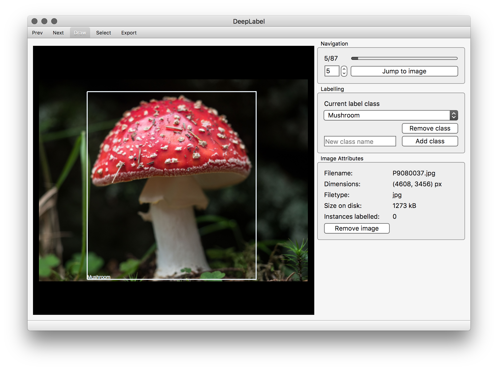

# DeepLabel

**Mac CI:** [](https://travis-ci.org/jveitchmichaelis/deeplabel)

**If you use DeepLabel for research or commercial purposes, please cite here!** [](https://zenodo.org/badge/latestdoi/105791274)

Download the [latest release](https://github.com/jveitchmichaelis/deeplabel/releases/latest)!

DeepLabel is a cross-platform tool for annotating images with labelled bounding boxes. A typical use-case for the program is labelling ground truth data for object-detection machine learning applications. DeepLabel runs as a standalone app and compiles on Windows, Linux and Mac.

Deeplabel also supports running inference using state-of-the-art object detection models like Faster-RCNN and YOLOv4. With support out-of-the-box for CUDA, you can quickly label an entire dataset using an existing model.

**Note: Deeplabel for Windows now packages CUDA and CUDNN for inference. This results an enormous distributable size as the cudnn inference libraries are 600MB+ alone. The CUDA runtime adds another 300MB. I'm looking into uploading simultaneous non-CUDA releases to save space. The alternative is to ask you to install CUDA and CUDNN yourself, but you'd need the correct version which is a pain.**

Ready made binaries for Windows and OS X are on the release page. It is recommended that you build for Linux yourself.



DeepLabel was built with convenience in mind. Image locations, classes and labels are stored in a local sqlite database (called a _project_, in the application). When a label is added or removed, this is immediately reflected in the database.

A typical workflow for DeepLabel is:

1. Create a new project database
2. Add a folder of images, or manually select images to add
3. Load in a class list, or manually add classes
4. Label the images
5. Export data in the desired format

## Data import

Currently you can import data in the following formats:

* Darknet (provide image list and names)
* COCO (provide an annotation .json file)

## Data export

Currently you can export in:

* KITTI (e.g. for Nvidia DIGITS)
* Darknet for YOLO
* Pascal VOC
* COCO (experimental)

Deeplabel treats your data as "golden" and does not make any attempt to modify it directly. This is a safe approach to avoid accidental corruption of a dataset that you spent months collating. As such, when you export labels, a copy of your data will be created with associated label files. For example, KITTI requires frames to be numerically labelled. In the future, augmentation may also be added, which is another reason to **not** modify your existing images.

When exporting to darknet, you should specify an existing "names" file so that your output labels have consistent class IDs. Similarly, when you export to Pascal VOC, you have the option of exporting a label map file which maps class IDs to labels. This file is quite easy to generate yourself (and you may already have it). The format is:

```
{
item {
  name: some_class
  id: 1
  displayname: some_class
}
```

DeepLabel will split your data into train and validation sets, you can choose what fraction to use (you can set 0% or 100% if you just want a test or validation set).

Since the labelling metadata is in the sqlite database, it should be fairly easy to write a Python script (or whatever) to convert the output to your preferred system. Many frameworks will accept Pascal VOC formatted data, so that's a good start.

## Model inference (automatic tagging)

DeepLabel now supports automatic image tagging from a pre-trained model. A good approach for rapidly tagging thousands of images is to train a "rough" model on a small subset of your data, use that model to tag more data, correct the labels as required, and repeat. Over time, the model will get better and better and you will need to make fewer corrections.

### Supported models

You can load in a Darknet-type model, for example Yolov3, Yolov3-spp and Yolov3-Tiny or  a Tensorflow model.

Most of the standard Tensorflow models are supported e.g. Faster-RCNN, Mobilenet-SSD. Currently the assumption is that the model ends with a `DetectionOutput` layer. This is an Nx7 sized tensor where `N` is the number of output labels, after non-maximum suppression has been applied (typically 100 for stock models). The columns are `batch id, class id, confidence, box coords`. 

You need to provide:

* The model configuration file (`.cfg, .pbtxt`)
* The model weights (`.weights, .pb`)
* A names file (`.names`)

The extension doesn't really matter, but these are the standard ones.

**Note: ensure that your names file corresponds to the expect label IDs that your model outputs. For example, Darknet uses an 80-class file, Tensorflow models often use a 91-class file, MobileNet-SSD outputs labels starting from 1, Faster-RCNN outputs labels starting from 0, etc.**

You can then run inference on a single image (the magic wand icon), or an entire project (`Detection->Run on Project`). On a modern CPU, Yolov3 takes around 0.5 seconds to tag a full HD image. DeepLabel will use OpenCV's OpenCL backend by default (you can select CPU if necessary), which should provide some acceleration on GPUs.

If you're not seeing any detections, you can adjust the confidence threshold (`Detection->Set Threshold`). If your detection boxes look right, but the classe labels are wrong, check your names file is correct.

Download Tensorflow models for testing from OpenCV [here](https://github.com/opencv/opencv/wiki/TensorFlow-Object-Detection-API).

### Target

You can run models on CPU or OpenCL. All models will work on CPU. You may see a speed up with OpenCL, but the CPU backend is far more heavily optimised (and typically is better than other framework's CPU performance).

OpenCL support is somewhat experimental and you may get an out-of-memory error (and Deeplabel will unceremoniously crash). Try with CPU if this happens. Typical performance is anywhere from 50 ms for Tiny Yolov3 to a couple of seconds for Faster-RCNN

## 16-bit File Handling

Deeplabel supports 16-bit images and will automatically scale the colours to 8-bit grayscale. 

You can optionally apply a colourmap to a single channel image, which may improve contrast.

In the future, support should be added for OpenCV's Tensorflow backend.

## Bounding box tracking and refinement

DeepLabel supports multi-threaded object tracking for quickly labelling video sequences. Simply label the first frame, initialise the tracker and select "propagate on next image". The software will initialise a tracker for each bounding box and attempt to track it in the next frame. If tracking is lost, you can re-label the offending image, restart the tracker and keep going. In this way, you can quickly label thousands of images in minutes.

DeepLabel also supports bounding box refinement using some simple thresholding and contour segmentation techniques. This was designed for labelling thermal infrared images, but it should work on colour images too. It works best if the object has a high contrast. It will also probably fail if you have two overlapping objects that look very similar.

An experimental foreground/background segmenter is being tested, but it seems to be a bit overenthusiastic right now.

## Video support

DeepLabel currently supports videos by a brute force route. You can load in a video which will be automatically split into JPEG frames and then loaded into your label database. Currently the entire video will be loaded, though in the future functionality will likely be similar to VOTT with frame skip options and no need to split the video beforehand. Note that when dealing with videos you will typically need to export them as separate frames anyway.

Any video format that OpenCV (and its backends) can open should work.

Installation
--

It's recommended that you use Qt5, but Qt4 will probably work. You need to have Qt's SQL extensions installed.

**OpenCV Requirements**

This is mostly a pure Qt project, but there are some limitations to what Qt can do with images. In particular, scaling sucks (even with `Qt::SmoothTransform`). Qt's image reader is also not particularly robust, so OpenCV is used there. OpenCV is also used for image augmentation. On OS X or Linux it's expected that you have `pkg-config` installed to handle dependencies. 

You need to compile OpenCV with contrib (`-DOPENCV_EXTRA_MODULES_PATH`) for object tracking. You should also compile with (`-DOPENCV_GENERATE_PKGCONFIG`). Only OpenCV 4+ is supported due to API changes. Make sure you checkout the same tagged release for the main repository and the contrib repository.

``` bash
git clone https://github.com/opencv/opencv
git clone https://github.com/opencv/opencv_contrib
cd opencv && git checkout 4.0.0 && cd ../
cd opencv_contrib && git checkout 4.0.0 && cd ../
```

On Mac, Homebrew automatically include pkg-config support and the contrib packages.

**Linux**

Build opencv using your preferred method. You need Qt5 installed - not just Qt Creator.

Clone the repository, then:

```bash
git submodule update --init --recursive
qmake -makefile -o Makefile DeepLabel.pro
make -j4
```

**Mac**
Install dependencies using Homebrew:
``` bash
brew install qt opencv
```

Note that qt is not linked by default, so either force link it (`brew link -f qt`) or follow the post-install instructions to see where qmake is installed.

Clone the repo, open the pro file in Qt Creator and build. Deployment is automatic on Windows and OS X. Alternatively:

```bash
git submodule update --init --recursive
qmake -makefile -o Makefile DeepLabel.pro
make -j4
```

`madeployqt` is automatically run after compilation, and on OS X will build a `.dmg` file. This does have the irritating side effect of linking and copying every `dylib` OpenCV has to offer so feel free to dig into the package and delete some of the dylibs that you don't need. This is a tradeoff between output file size and convenience.

**Windows**

Unfortunately you need to install OpenCV from source, because the official binary releases don't include the contrib modules (which include tracking algorithms and DNN support). Or just download a DeepLabel release from [here](https://github.com/jveitchmichaelis/deeplabel/releases).

Once you've installed OpenCV...(!)

Clone the repo, update the submodules to fetch QtAwesome, open the pro file in Qt Creator and modify the paths to your opencv install. Build as normal. Make sure you copy all the OpenCV DLLs after install.

Usage
--

Using the software should be fairly straightforward. Once you've created a project database and added images to it, you can get on with the fun part of adding bounding boxes.

DeepLabel operates in two modes: draw and select. In **draw** mode, you can click to define the corners of a bounding box rectangle. If you're happy with the box, hit space to confirm. The rectangle will be added to the image with a class label.

If you need to delete a label, switch to **select** mode. Click on a rectangle, it will highlight green, the hit delete or backspace to remove it.

All changes are immediately relected in the database.

Navigate through images using the left/right or a/d keys. You should find a/d to be quite a natural way of navigating without moving your left hand. There is a progress bar to indicate how far through the dataset you've labelled.

Once you're done labelling, open the export menu to copy and rename your images and generate label files.

Notes
--

#### Overlapping bounding boxes

DeepLabel doesn't care if your bounding boxes overlap, but selecting overlapping bounding boxes is a tricky problem from a UI point of view. Currently the solution is simple: all rectangles containing the cursor will be highlighted and if you hit delete, the most recent one will be deleted.

#### Image paths

Image paths in the database are stored relative to the database location. This means you can easily copy over files to another system, provided you keep the relative structure of the files.

#### Support for other descriptors (e.g. occluded, truncated)

In the future I'd like to add the ability to mark labels as occluded or truncated. I haven't decided on the best way to implement this yet - most detector networks don't use this information, but it's useful for stats.

#### Database schema

DeepLabel uses a simple relational database with the following schema:

	CREATE TABLE classes (class_id INTEGER PRIMARY KEY ASC, name varchar(32))
	CREATE TABLE images (image_id INTEGER PRIMARY KEY ASC, path varchar(256))
	CREATE TABLE labels (label_id INTEGER PRIMARY KEY ASC, image_id int, class_id int, x int, y int, width int, height int)

These fields are the bare minimum and more may be added later (see note on descriptors above). It may also be useful to include metadata about images for statistics purposes.

#### License

This code is MIT licensed - feel free to fork and use without restriction, commercially or privately, but please do cite. Copyright Josh Veitch-Michaelis 2017.
